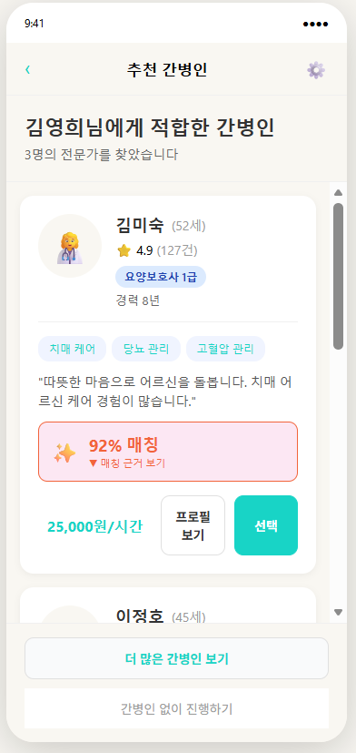
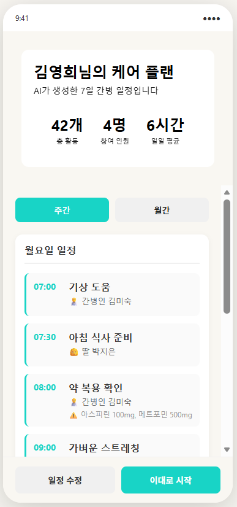
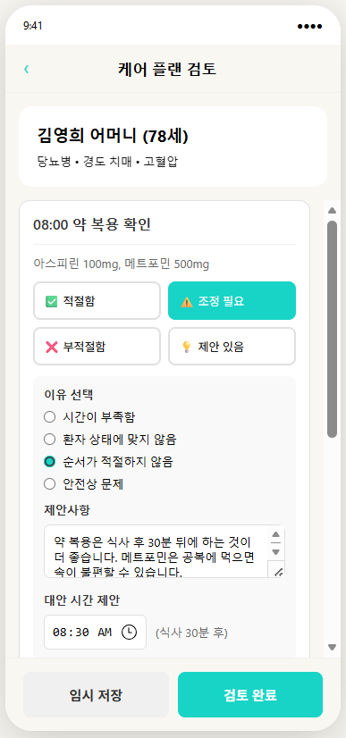
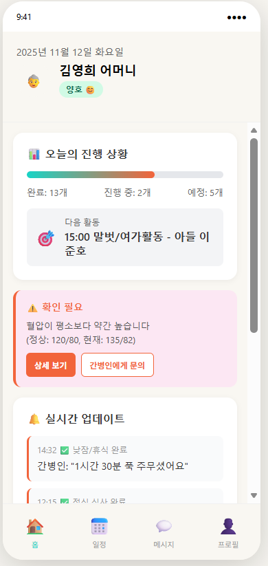

# 🏥 **늘봄케어(Neulbom Care)** - AI 기반 간병인 매칭 플랫폼

> **"성향이 맞는 간병인을 찾는 것, 더 이상 운에만 맡기지 마세요"**
>
> AI가 환자와 간병인의 성향을 분석해 **최적의 매칭**을 자동으로 제안합니다.


---

## 🚀 **문제: 왜 지금 이 서비스가 필요할까?**

### 현재의 간병 매칭, 이렇게 불편합니다

**👴 환자와 가족의 고민**

- "간병인에게 뭘 시켜야 하는지 모르겠어요"
- "제대로 케어하고 있는지 확인할 방법이 없어요"
- "가족 구성원들과 간병 정보를 어떻게 공유하지?"

**💼 간병인의 현실**

- 부정확한 매칭으로 인한 빈번한 이직 (현재 이직률 **45%**)
- 성향 불일치로 인한 스트레스와 번아웃
- 체계적인 일정 관리 부재

**📊 의료 시스템의 문제**

- 수작업 매칭으로 인한 **시간 낭비** ⏱️
- 객관적 평가 기준 부재
- 데이터 기반 의료 서비스 불가능

### 📈 **시장 규모: 더 이상 무시할 수 없는 수요**

- 2025년 기준 **고령 인구 20% 이상** (급증하는 추세)
- 가정 간병 수요 **폭발적 증가**
- 간병인 공급 부족 심화

---

## 💡 **솔루션: 4개의 AI 기반 핵심 기능**

<table>
  <tr>
    <td width="50%">
      <div align="center">
        
        <h4>1️⃣ AI 맞춤 매칭 엔진</h4>
        <p><strong>XGBoost 기반</strong> 최적의 환자-간병인 매칭</p>
        <small>• 4가지 성향 축 분석<br/>• 60% 성향 + 40% 간병 호환도<br/>• 88.65% 정확도</small>
      </div>
    </td>
    <td width="50%">
      <div align="center">
        
        <h4>2️⃣ 스마트 일정 관리</h4>
        <p>자동 최적화 & 실시간 공유</p>
        <small>• 간병 공백 방지<br/>• 가족 구성원 공유<br/>• 모바일 앱 지원</small>
      </div>
    </td>
  </tr>
  <tr>
    <td width="50%">
      <div align="center">
        
        <h4>3️⃣ 약물 관리 시스템</h4>
        <p>스마트 복약 지도 자동화</p>
        <small>• 오진약 방지<br/>• 약물 상호작용 검사<br/>• 실시간 모니터링</small>
      </div>
    </td>
    <td width="50%">
      <div align="center">
        
        <h4>4️⃣ 통합 대시보드</h4>
        <p>모든 정보 한눈에 보기</p>
        <small>• 건강 상태 추적<br/>• 간병 품질 관리<br/>• 가족 소통 공간</small>
      </div>
    </td>
  </tr>
</table>

---

## 📊 **기대 효과: 실제 수치로 증명된 가치**

| 지표              | 개선 효과    |
| ----------------- | ------------ |
| **환자 만족도**   | 30-40% ↑     |
| **가족의 부담**   | 67% ↓ (주당) |
| **간병인 이직률** | 45% → 25% ↓  |
| **의료비 절감**   | ₩3.65조 규모 |

---

## 🤖 **AI 매칭 알고리즘 상세 설명**

### 알고리즘의 작동 원리

#### **Step 1: 성향 점수 추출**

```
환자: [공감도: 6.2, 인내심: 7.5, 활동성: 5.0, 자립도: 4.8]
간병인: [공감도: 7.1, 인내심: 8.2, 활동성: 6.3, 자립도: 5.5]
```

#### **Step 2: 차이값 계산 (낮을수록 좋음)**

```
공감도 차이: |6.2 - 7.1| = 0.9
인내심 차이: |7.5 - 8.2| = 0.7
활동성 차이: |5.0 - 6.3| = 1.3
자립도 차이: |4.8 - 5.5| = 0.7
```

#### **Step 3: 가중치 적용**

```
성향 호환도 (60%):
- 평균 차이: (0.9 + 0.7 + 1.3 + 0.7) / 4 = 0.9
- 호환도 점수: 100 - (0.9 × 10) = 91점

간병 호환도 (40%):
- 선호 간병 유형 매칭: 85점
```

#### **Step 4: 최종 매칭 점수**

```
최종 점수 = (91 × 0.6) + (85 × 0.4) = 54.6 + 34 = 88.6점

✅ "높은 호환성" - 매칭 추천!
```

---

## 📈 **AI 모델 성능 비교: V2 vs V3**

### V2 모델 (시뮬레이션 데이터)

- **데이터셋**: 2,000개 샘플 (생성 데이터)
- **R² 점수**: 0.9508 ⭐
- **정확도**: 94.50%
- **특징**: 완벽한 패턴, 낮은 현실성

### V3 모델 (실제 데이터) - 현재 사용 모델 🎯

- **데이터셋**: 10,000개 샘플 (실제 인구통계 데이터)
- **R² 점수**: 0.7927
- **정확도**: 88.65%
- **특징**: 현실 기반, 높은 신뢰성

> **왜 V3를 선택했나?**
> V2는 시뮬레이션이라 패턴이 완벽하지만, 실제 운영 환경에서는 V3의 "현실적 다양성"이 더 신뢰할 수 있습니다.

---

## 🏗️ **프로젝트 구조**

```
bluedonulab-01/
├── Match_Algorithm_System/
│   ├── match/                 # V1 - 규칙 기반 알고리즘 (레거시)
│   ├── match_ML/              # V2 - 시뮬레이션 데이터 기반
│   └── match_ML_v3/           # V3 - 실제 데이터 기반 (현재 사용)
│       ├── data/
│       ├── models/            # ONNX 형식 모델
│       ├── train_models_v3.py
│       └── V2_vs_V3_COMPARISON.md
│
├── backend/                   # FastAPI 백엔드
│   ├── app/
│   │   ├── core/              # 설정
│   │   ├── models/            # DB 모델
│   │   ├── routes/            # API 엔드포인트
│   │   └── schemas/           # Pydantic 스키마
│   ├── main.py
│   └── requirements.txt
│
├── frontend/                  # Next.js 프론트엔드
│   └── my-app/
│       ├── app/
│       ├── components/
│       ├── public/
│       └── package.json
│
├── data/                      # 훈련 및 참고 데이터
├── assets/                    # UI/UX 스크린샷, 다이어그램
├── docs/                      # 기술 문서
└── README.md
```

---

## 🚀 **빠른 시작 가이드**

### 필수 요구사항

- Python 3.10+
- Node.js 18+
- PostgreSQL 13+

### 1️⃣ 백엔드 설정

```bash
# 가상환경 생성
python -m venv venv

# 활성화 (Mac/Linux)
source venv/bin/activate

# 의존성 설치
pip install -r backend/requirements.txt

# 환경변수 설정
cp backend/.env.example backend/.env

# 백엔드 실행
python backend/main.py
```

### 2️⃣ 프론트엔드 설정

```bash
cd frontend/my-app

# 의존성 설치
npm install

# 개발 서버 시작
npm run dev
```

기본적으로 다음 주소에서 실행됩니다:

- **프론트엔드**: http://localhost:3000
- **백엔드**: http://localhost:8000

---

## 📚 **주요 기술 스택**

### 백엔드

- **FastAPI** - 빠르고 현대적인 Python 웹 프레임워크
- **SQLAlchemy** - ORM 데이터베이스 매핑
- **Pydantic** - 데이터 검증 및 설정 관리
- **Uvicorn** - ASGI 서버

### 프론트엔드

- **Next.js 14** - React 기반 풀스택 프레임워크
- **TypeScript** - 타입 안전성
- **Tailwind CSS** - 유틸리티 기반 스타일링
- **React 19** - 최신 리액트

### 머신러닝

- **XGBoost** - 그래디언트 부스팅 알고리즘
- **ONNX** - 크로스 플랫폼 모델 배포
- **Scikit-learn** - 기타 ML 알고리즘 (RF, SVM 등)

---

## 🔗 **배포 및 운영**

### 목표 아키텍처

```
Frontend (Next.js)
    ↓
API Gateway
    ↓
Backend (FastAPI)
    ↓
Database (PostgreSQL) + ML Models (ONNX)
```

### 클라우드 배포 (Azure 기준)

- **App Service** - 백엔드 및 프론트엔드 호스팅
- **SQL Database** - PostgreSQL 관리형 데이터베이스
- **Blob Storage** - 모델 및 이미지 저장소
- **Application Insights** - 모니터링 및 로깅

---

## 📖 **문서**

- [기술 아키텍처 설계](./docs/아키텍처_설계.md)
- [매칭 알고리즘 상세 설명](./docs/알고리즘_설명서_WHY중심_최종버전.md)
- [V2 vs V3 모델 비교](./Match_Algorithm_System/match_ML/V2_vs_V3_COMPARISON.md)
- [데이터셋 분석 전략](./docs/DATA_ANALYSIS_STRATEGY.md)

---

## 👥 **팀**

**2025 SeSAC 해커톤**

- **팀명**: Blue Donut Lab
- **목표**: AI를 통한 간병 서비스의 혁신

---

<div align="center">

**만들어진 사람들의 마음으로** ❤️
**더 나은 간병 서비스를 위해** 🏥

</div>
